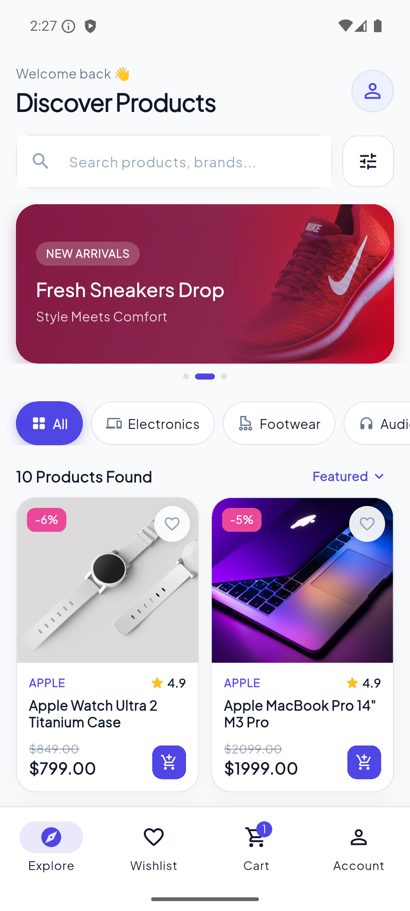
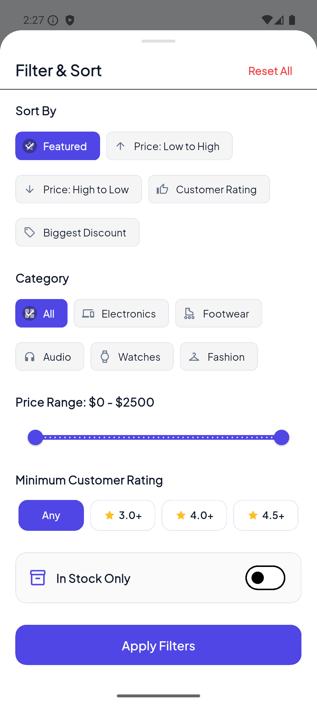
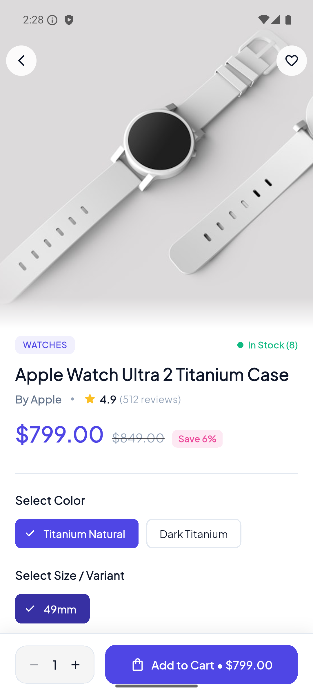
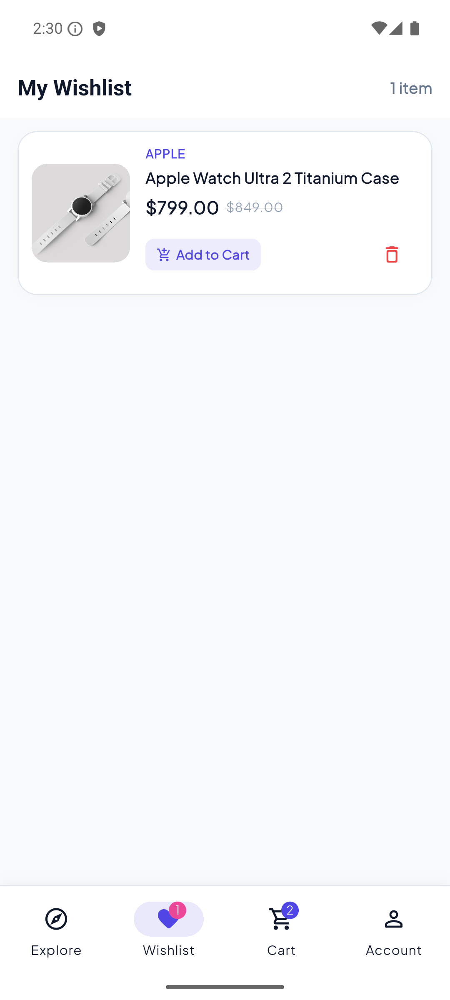
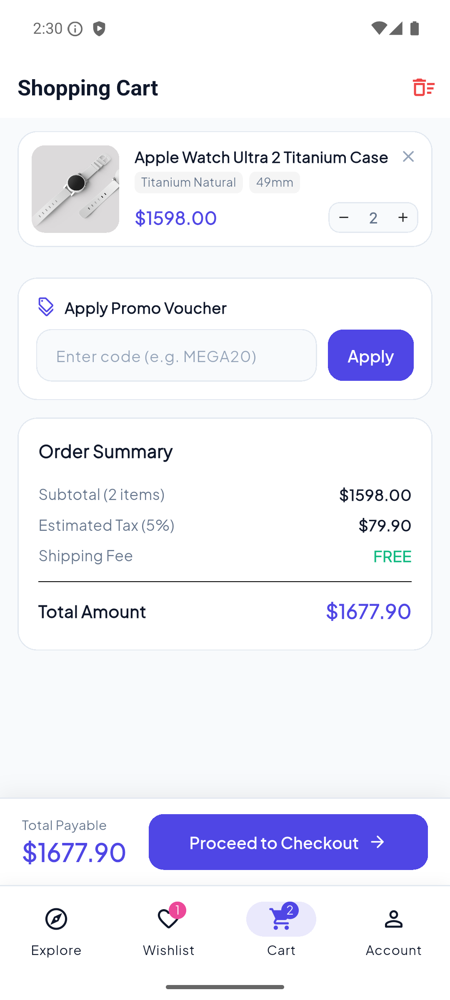
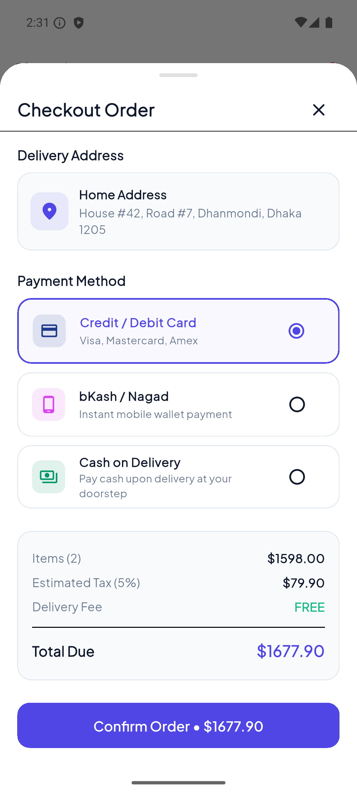
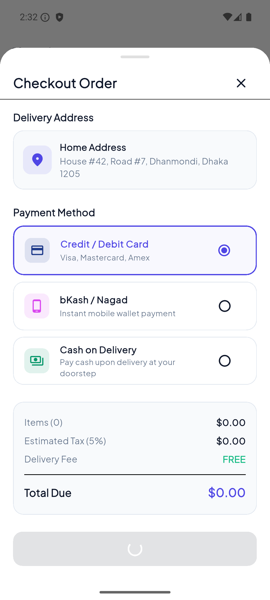
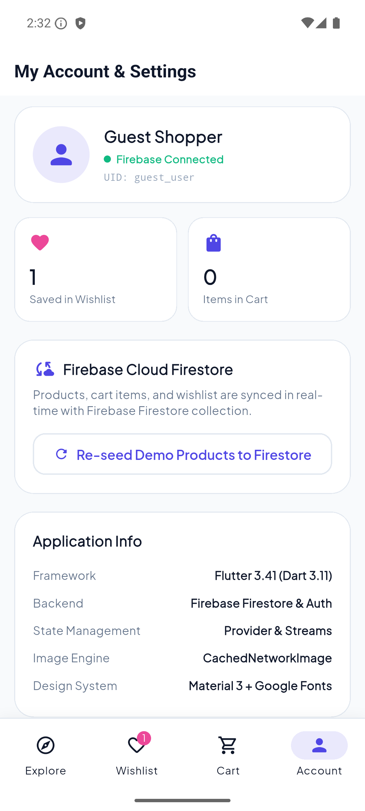

# MegaStore - Flutter & Firebase E-Commerce App

A modern, full-featured E-Commerce mobile application built with **Flutter 3.41** and integrated with **Firebase (Cloud Firestore & Firebase Auth)**.

---

## 📱 Live Download APK (19 MB)

Download and test the release APK directly on any Android device:
- 🚀 **[Download Release APK (19.9 MB - arm64)](https://files.catbox.moe/1hzv3s.apk)** *(Recommended for 99% of modern Android devices)*
- 🌐 **[Alternative Mirror (temp.sh)](https://temp.sh/fCMpf/app-release.apk)**

---

## 📸 App Screenshots

| 1. Explore & Home | 2. Filter & Sort Modal | 3. Product Details | 4. Wishlist Screen |
|:---:|:---:|:---:|:---:|
|  |  |  |  |

| 5. Shopping Cart | 6. Checkout & Payment | 7. Order Confirmation | 8. Firebase & Settings |
|:---:|:---:|:---:|:---:|
|  |  |  |  |

---

## ✨ Features

- **🔥 Firebase Backend Integration**:
  - **Cloud Firestore**: Real-time product streaming, user cart sync, and wishlist sync.
  - **Firebase Auth**: Anonymous guest authentication for individual user sessions.
  - **One-Tap Data Seeding**: Populates high-definition sample catalog to Firestore automatically.
- **🔍 Live Search & Multi-Criteria Filtering**:
  - Instant search across product titles, brands, and categories.
  - Category selector chips (Electronics, Footwear, Audio, Watches, Fashion).
  - Price Range Slider ($0 – $2500).
  - Minimum customer rating filter (3.0+, 4.0+, 4.5+).
  - In-stock only filter.
  - Sorting (Featured, Price: Low to High, Price: High to Low, Rating, Discount).
- **❤️ Interactive Wishlist**:
  - Instant heart toggle on cards and detail screen.
  - Real-time badge counter on bottom navigation.
  - Direct "Add to Cart" and "Remove" from wishlist.
- **🛍️ Shopping Cart & Checkout**:
  - Quantity controls (`+` / `-`) with dynamic price calculations.
  - Promo vouchers support (e.g. `MEGA20` for 20% discount, `WELCOME10` for 10% discount).
  - Delivery Fee & 5% Tax breakdown.
  - Interactive Checkout Dialog with payment methods (Card, bKash / Mobile Banking, Cash on Delivery).
- **🎨 Premium UI / UX**:
  - Material 3 design system with Google Fonts (`Plus Jakarta Sans`).
  - Smooth micro-interactions and hero image animations.

---

## 🛠️ Tech Stack

- **Framework**: Flutter 3.41.6 (Dart 3.11.4)
- **Backend**: Firebase Cloud Firestore & Firebase Authentication
- **State Management**: Provider (6.1.5)
- **Image Caching**: CachedNetworkImage (3.4.1)
- **Typography**: Google Fonts (8.2.1)

---

## 🚀 Running Locally

```bash
# Clone the repository
git clone https://github.com/imamhossenbu/flutter-mega-assignment.git

# Install dependencies
flutter pub get

# Run tests
flutter test

# Run on connected device or emulator
flutter run
```
