# 🛍️ MegaStore — Flutter & Firebase E-Commerce App

[](https://flutter.dev)
[](https://dart.dev)
[](https://firebase.google.com)
[](https://cloudinary.com)
[](LICENSE)

A modern, full-stack **E-Commerce Application** built with **Flutter** and backed by **Firebase (Cloud Firestore + Firebase Authentication)** with **Cloudinary Image CDN** integration. 

MegaStore delivers a dual-interface architecture:
1. **Customer Storefront**: Borderless, sleek shopping experience featuring catalog exploration, instant cart adjustments, promo voucher calculations, real-time order tracking, and customer dashboard metrics.
2. **Admin Control Center**: Comprehensive store management dashboard with live revenue metrics, inventory catalog management with quick restock, atomic order pipeline processing, voucher CRUD, and role-based user management.

---

## 📸 App Screenshots

### 🛒 Customer Storefront (User Experience)

| 01. Home & Discover | 02. Filter & Sort | 03. Product Details |
|:---:|:---:|:---:|
| 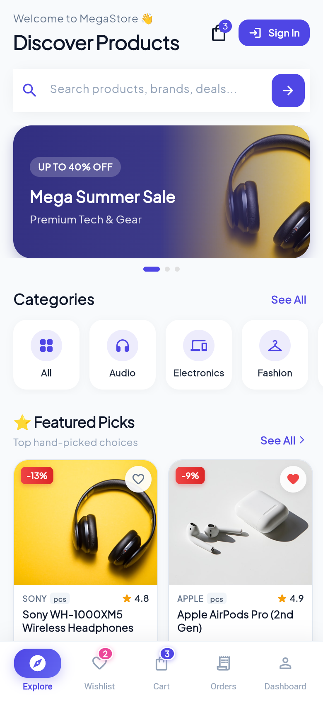 | 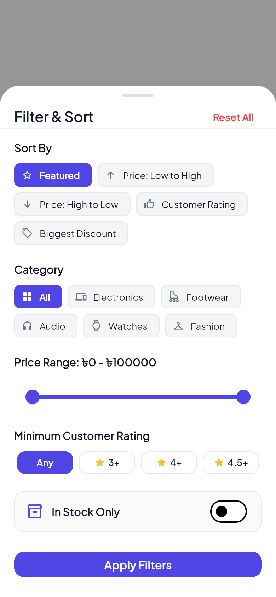 | 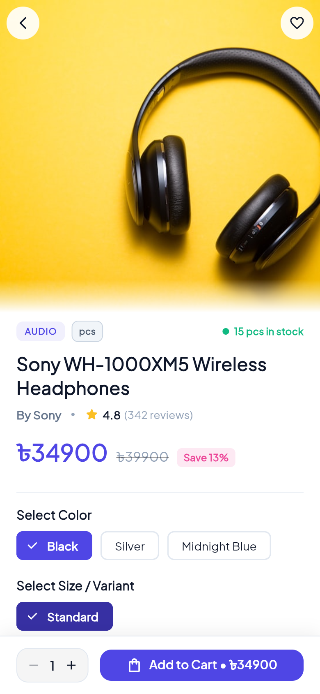 |
| *Hero banners, categories & featured picks* | *Price slider, ratings & category filters* | *Color & size chips, specs & Add to Cart* |

| 04. Shopping Cart | 05. Checkout Modal | 06. Order Confirmation |
|:---:|:---:|:---:|
| 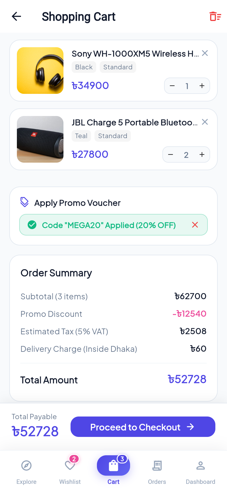 | 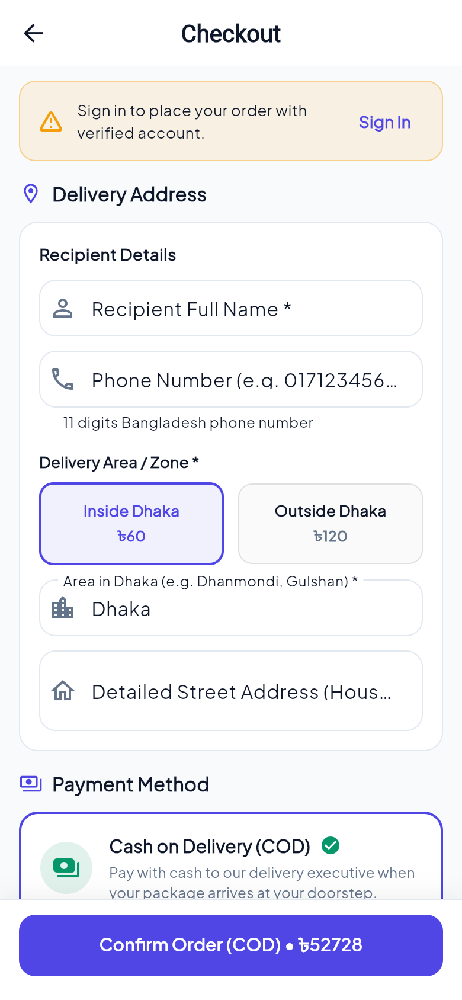 | 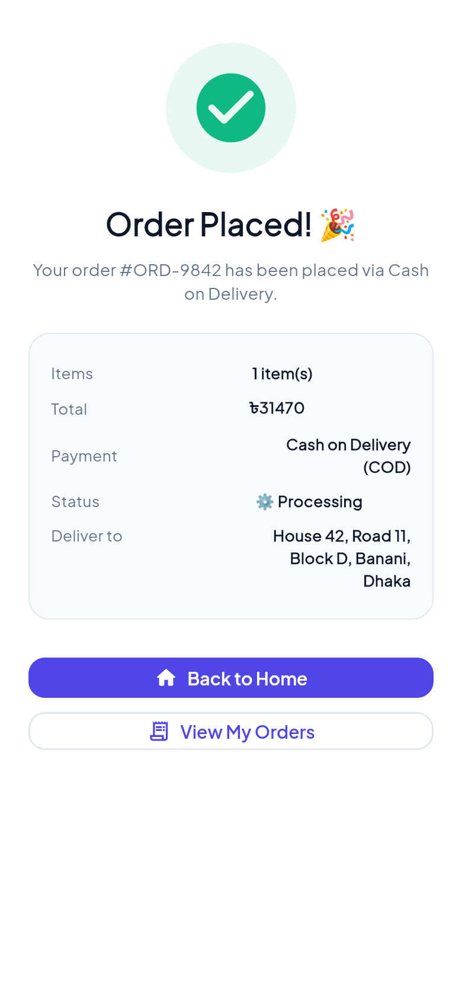 |
| *Quantity controls & applied 20% promo voucher* | *BD address form & Cash on Delivery (COD)* | *Instant order snapshot & tracking ID* |

| 07. Orders Tracking | 08. Wishlist | 09. Customer Profile |
|:---:|:---:|:---:|
| 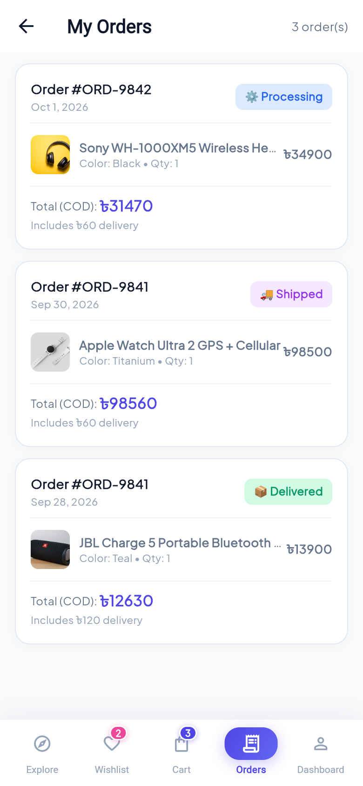 | 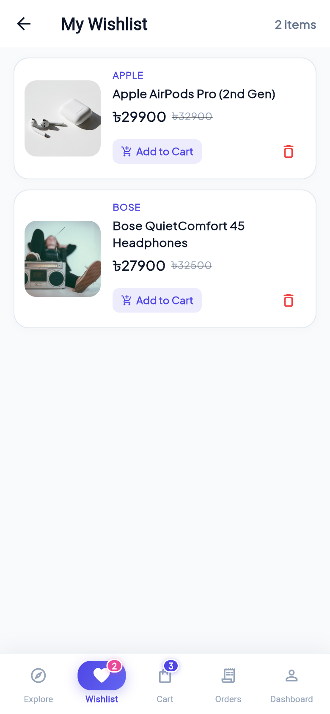 | 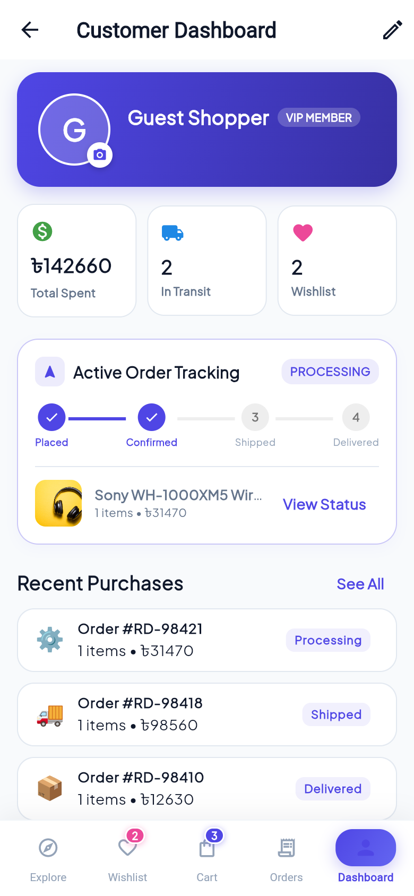 |
| *Live status badges (Processing, Shipped, Delivered)* | *Saved favorites with one-tap Add to Cart* | *Financial KPIs, spent amount & order tracking* |

| 10. Authentication / Sign In | | |
|:---:|:---:|:---:|
| 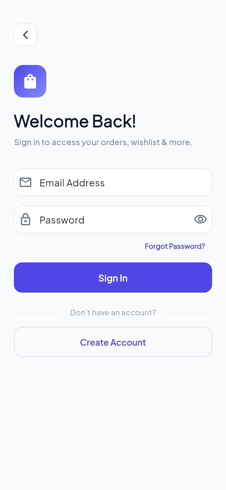 | | |
| *Clean sign in with email & password* | | |

---

### ⚙️ Admin Control Center

| 11. Dashboard Overview | 12. Product Inventory | 13. Add / Edit Product |
|:---:|:---:|:---:|
| 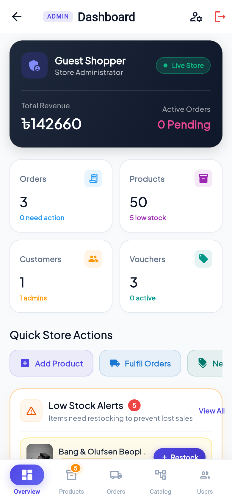 | 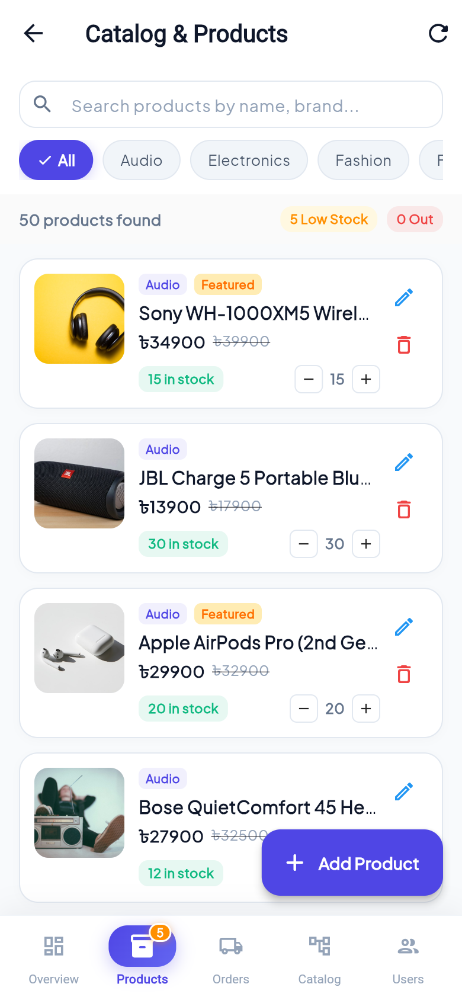 | 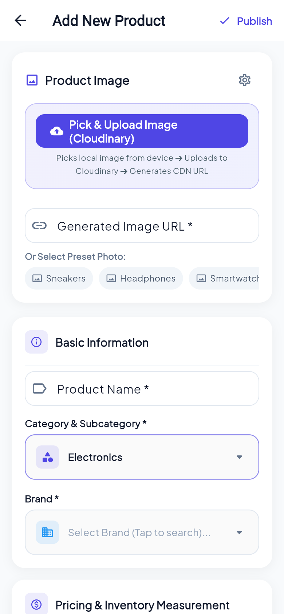 |
| *Live revenue, active orders & low stock alerts* | *50 products, category pills & quick stock adjustment* | *Cloudinary image upload & attribute configuration* |

| 14. Order Management | 15. Catalog & Variants | 16. Promo Vouchers |
|:---:|:---:|:---:|
| 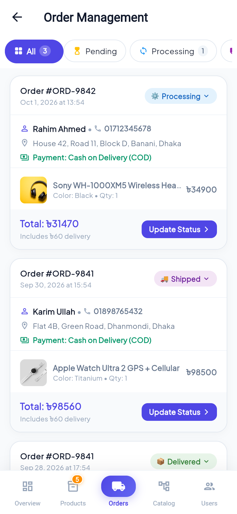 | 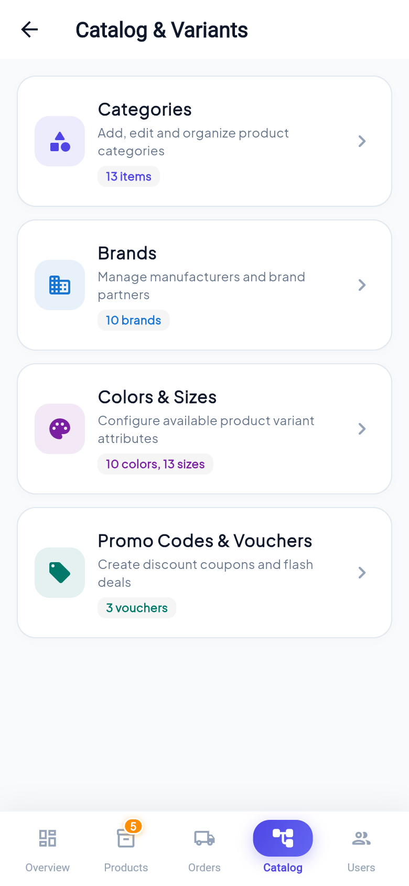 | 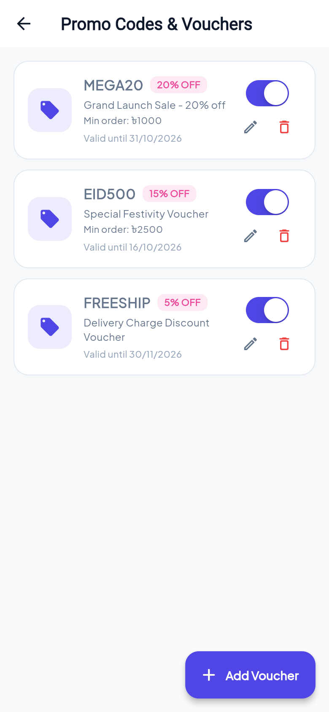 |
| *Status pipeline (Pending → Processing → Shipped)* | *Categories, Brands, Colors & Size trees* | *Discount % vouchers with minimum order limits* |

| 17. Users & Roles | | |
|:---:|:---:|:---:|
| 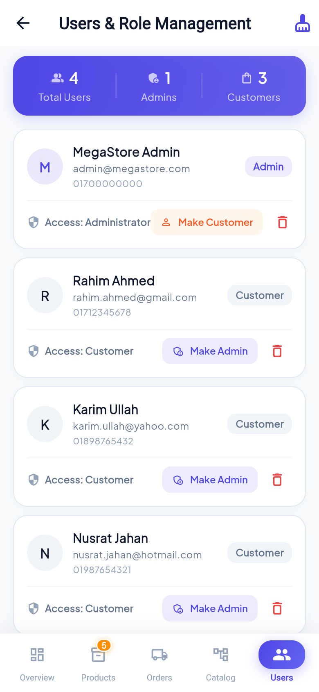 | | |
| *User directory with Admin / Customer role toggles* | | |

---

## 🗂️ Seed Data & Catalog Overview

MegaStore includes **50 pre-configured products** across 5 primary categories with high-resolution Unsplash CDN imagery, realistic BDT (`৳`) pricing, varied inventory stock counts, and rich specifications:

| Category | Product Count | Featured Brands | Price Range (BDT) |
|:---|:---:|:---|:---:|
| 🎧 **Audio** | 10 | Sony, Apple, Bose, JBL, Marshall, Sennheiser, Beats | ৳8,500 – ৳34,900 |
| ⌚ **Watches** | 8 | Apple, Fossil, Samsung, Seiko, Garmin, Casio, Xiaomi | ৳6,900 – ৳98,500 |
| 💻 **Electronics** | 12 | Apple, Sony, Samsung, Asus, Canon, DJI, Logitech, Anker | ৳4,500 – ৳185,000 |
| 👟 **Footwear** | 10 | Nike, Adidas, New Balance, Puma, Vans, Converse, Jordan | ৳6,900 – ৳19,900 |
| 👗 **Fashion** | 10 | Levi's, Brooks Brothers, Tommy Hilfiger, Ray-Ban, Fossil | ৳3,200 – ৳22,500 |

### 🎟️ Default Promotional Vouchers
- **`MEGA20`**: 20% discount on orders exceeding ৳1,000.
- **`EID500`**: 15% discount on orders exceeding ৳2,500.
- **`FREESHIP`**: 5% delivery compensation voucher.

---

## 🌟 Key Architecture & Features

### 🛒 1. Customer Storefront
- **Live Catalog & Soft Deletes**: Real-time Firestore catalog streaming. Soft-deleted products (`isDeleted: true`) are automatically filtered out from storefront browsing while maintaining complete historical order integrity.
- **Cash on Delivery (COD) Only**: Strict application policy enforcing Cash on Delivery for authentic local fulfilment.
- **Bangladeshi Phone & Address Validation**: Mandatory 11-digit phone number format (`01XXXXXXXXX` or `+880`) verified across authentication and order checkout.
- **Zoned Delivery Charges**: Automatic delivery charge calculation based on destination (৳60 for Dhaka City, ৳120 for outside Dhaka).
- **Atomic Order Placement**: Server-grade transaction model that verifies product stock, price freshness, and discount vouchers atomically before deducting inventory and logging the immutable line-item snapshot.
- **Saved Wishlist & Cart Persistence**: Synced in-memory and Firestore collections with live badge counts on bottom navigation.

### ⚡ 2. Admin Control Center
- **Executive Analytics Dashboard**: Instant snapshot of Total Revenue, Active Orders, Low Stock Alerts, Registered Customers, and Active Promo Vouchers.
- **Inventory & Quick Restock**: One-tap stepper (`-` / `+`) stock updates and restock triggers directly from product list cards.
- **Order State Machine Pipeline**: Strict, audited order progression:
  $$\text{Pending} \longrightarrow \text{Processing} \longrightarrow \text{Shipped} \longrightarrow \text{Delivered}$$
  $$\text{Pending / Processing} \longrightarrow \text{Cancelled (Restores stock automatically)}$$
- **Cloudinary Image CDN**: Unsigned image uploads with automated responsive transformations.
- **Role-Based Access Control**: Instant role escalation/demotion between `customer` and `admin`.

### 🎨 3. UI Design System
- **No Black Borders**: All harsh borders replaced with `AppTheme`-defined soft slate tones (`#E2E8F0`).
- **Responsive Mobile Frame on Web**: Built-in `MaterialApp.builder` that centers the mobile screen frame at `430px` max-width with dark slate backdrop when viewed on desktop browsers or Chrome.
- **Smooth Navigation**: Custom `ModernBottomNav` with active pill indicators and dynamic badge counters.

### 🧱 4. Decoupled Repository Pattern
All database operations are abstracted behind clean interfaces in `lib/repositories/`:
- [`AuthRepository`](file:///Users/imam/flutter_mega_assignment/lib/repositories/auth_repository.dart)
- [`ProductRepository`](file:///Users/imam/flutter_mega_assignment/lib/repositories/product_repository.dart)
- [`OrderRepository`](file:///Users/imam/flutter_mega_assignment/lib/repositories/order_repository.dart)
- [`CategoryRepository`](file:///Users/imam/flutter_mega_assignment/lib/repositories/category_repository.dart)
- [`BrandRepository`](file:///Users/imam/flutter_mega_assignment/lib/repositories/brand_repository.dart)
- [`PromoRepository`](file:///Users/imam/flutter_mega_assignment/lib/repositories/promo_repository.dart)
- [`AddressRepository`](file:///Users/imam/flutter_mega_assignment/lib/repositories/address_repository.dart)

---

## ⚙️ Environment Configuration (`.env`)

The project uses `flutter_dotenv` for environment configuration without exposing any API secrets in client code.

1. Copy the example file to `.env`:
   ```bash
   cp .env.example .env
   ```
2. Populate `.env` with your Cloudinary credentials (unsigned upload only):
   ```env
   CLOUDINARY_CLOUD_NAME=your_cloudinary_cloud_name
   CLOUDINARY_UPLOAD_PRESET=your_unsigned_upload_preset
   ```

> **Security Notice**: Never store private API keys or service account credentials in `.env`.

---

## 🔐 First Admin User Setup

1. Launch the app and navigate to the **Sign Up** screen (`/signup`).
2. Create an account with your desired admin email, secure password, full name, and a valid 11-digit Bangladesh phone number.
3. Open **Firebase Console** -> **Cloud Firestore** -> `users` collection.
4. Locate your user document, change the `role` field value from `'customer'` to `'admin'`, and save.
5. Log back into the app — the app will detect `role: 'admin'` and grant full access to the **Admin Control Center**.

---

## 🛡️ Firestore Security Rules & Indexes

Database access is guarded with security rule helpers (`isSignedIn()`, `isAdmin()`, `isOwner(uid)`):
- **Users**: Users can read/create their own document with default role `'customer'`. Regular users can never self-escalate their `role`.
- **Catalog** (`categories`, `brands`, `products`, `promo_codes`): Public read; write operations restricted exclusively to admins.
- **Orders**: Customers can create orders only if `userId == request.auth.uid`, `status == 'Pending'`, and `paymentMethod == 'Cash on Delivery'`. Customers can cancel pending orders. Deletions are forbidden.

Deploy security rules and compound indexes:
```bash
firebase deploy --only firestore:rules,firestore:indexes
```

---

## 🧪 Testing

### 1. Flutter Unit & Widget Tests
```bash
# Run all unit and widget tests
flutter test

# Run Dart static analyzer
flutter analyze
```

### 2. Firestore Security Rules Unit Tests (Emulator)
```bash
cd rules_test
npm install
npm test
```

---

## 🚀 Running the Project Locally

```bash
# Clone the repository
git clone https://github.com/imamhossenbu/flutter-mega-assignment.git
cd flutter-mega-assignment

# Get dependencies
flutter pub get

# Run on Chrome (renders in centered mobile frame)
flutter run -d chrome

# Or run on connected Android / iOS device
flutter run
```

---

## 📦 Android APK & GitHub Actions CI/CD (10–20 MB Optimized)

### 1. Build from GitHub (Cloud CI/CD)
The repository includes a ready-to-use GitHub Actions workflow [`.github/workflows/build_apk.yml`](.github/workflows/build_apk.yml).
- **Automatic Build**: Automatically triggers on every push to `main` or via **Workflow Dispatch** (manual trigger).
- **Download Link**: Go to [GitHub Actions](https://github.com/imamhossenbu/flutter-mega-assignment/actions) → select the latest run → download the `android-release-apks` zip containing the release APKs.

### 2. Local APK Build (10–20 MB Optimized)
To generate lightweight per-architecture APKs (17 MB – 20 MB):
```bash
# Optimized split-per-ABI build with code obfuscation
flutter build apk --split-per-abi --obfuscate --split-debug-info=build/app/outputs/symbols
```

**Generated Artifacts:**
| Architecture | APK File | Size | Compatibility |
|:---|:---|:---:|:---|
| **ARM 64-bit** | `app-arm64-v8a-release.apk` | **~20.4 MB** | Modern Android devices |
| **ARM 32-bit** | `app-armeabi-v7a-release.apk` | **~17.6 MB** | Older 32-bit devices |
| **x86_64** | `app-x86_64-release.apk` | **~21.8 MB** | Android Emulators & Tablets |

---

## 📄 License

This project is licensed under the MIT License - see the [LICENSE](LICENSE) file for details.
